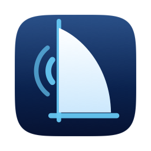
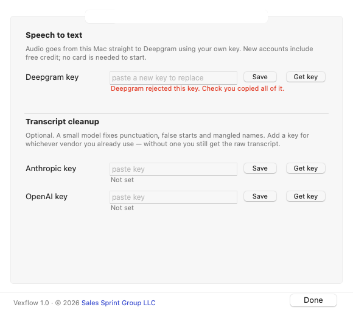
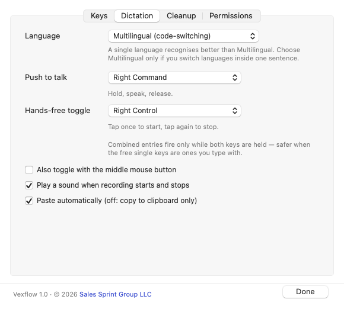
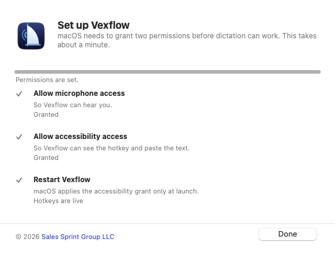

<p align="center">
  
</p>

<h1 align="center">Vexflow</h1>

<p align="center">
  Hold a key, talk, let go. The text lands wherever your cursor is.<br>
  A dictation client for macOS that runs on <b>your</b> API keys.
</p>

<p align="center">
  <a href="#install">Install</a> ·
  <a href="#what-it-costs">Cost</a> ·
  <a href="#the-privacy-model">Privacy</a> ·
  <a href="docs/TROUBLESHOOTING.md">Troubleshooting</a> ·
  <a href="#licence-and-legal">Licence</a>
</p>

---

## Why this exists

Dictation on a Mac comes in two shapes, and both ask for something.

The good ones are subscriptions. Your microphone audio — calls, drafts, half-formed
thinking, client names — goes to a startup you have not audited, under a privacy
policy that can be rewritten between funding rounds. You are trusting a company, not a
contract. That is a real cost, and for anyone handling other people's confidential
information it is not a small one.

The private ones run locally. That means a multi-gigabyte model download, a machine
with enough headroom to run it, and accuracy that drops the moment you switch
languages mid-sentence.

There is a third option that nobody was packaging: **use the vendors you already have
a commercial relationship with.** Deepgram for speech recognition, Anthropic or OpenAI
for cleanup. You hold the keys. Your audio goes from your Mac to a named vendor under
that vendor's terms — no intermediary service of ours, no telemetry, no account with
anyone new.

Vexflow is that client. It was built because the author dictates all day in three
languages and was not willing to route that through a company he could not name.

The whole thing is about two thousand lines of readable Python. You can audit the
network path in an afternoon, which is the point.

## What it does

- **Push to talk** — hold a modifier key or a chord (Control+Option), speak, release.
  Text is pasted at the cursor.
- **Hands-free toggle** — tap to start, tap again to stop, for longer stretches.
- **Works everywhere** — anywhere you can type: browser, terminal, Slack, email, notes.
- **Multilingual** — one language for best accuracy, or a mode that follows you when
  you switch languages mid-sentence. The interface itself speaks eleven languages and
  follows your Mac.
- **Optional LLM cleanup** — a small model fixes punctuation, false starts and mangled
  proper nouns. Bring a key from Anthropic or OpenAI, or point it at any
  OpenAI-compatible endpoint, or skip it entirely.
- **Your own vocabulary** — a plain text file of names and jargon the recogniser keeps
  getting wrong.
- **Survives sleep** — the failure mode where the microphone opens but stays deaf after
  a lid close is detected and repaired automatically. That one took two rounds to get
  right; see [`engine.py`](engine.py).

<p align="center">
  
  
</p>

## Install

Requires macOS 14 (Sonoma) or newer, on Apple silicon or Intel.

```bash
curl -fsSL https://raw.githubusercontent.com/salessprintgroup/vexflow/main/get.sh | bash
```

That fetches the current release and opens Apple's installer; the rest is Continue →
password → Done.

One package, eleven languages. The interface follows what macOS is set to on a fresh
install — English, Deutsch, Español, Français, Italiano, Nederlands, Polski, Português,
Türkçe, Русский, Українська — and **Settings → Interface language** changes it at any
time. [`i18n/`](i18n/) explains how to fix a word or add a language.

If piping a downloaded script into a shell is not something you do — a fair position,
and this project argues for that kind of caution elsewhere — [read it first](get.sh).
It is sixty lines and it downloads one file.

<details>
<summary>Taking the .pkg from Releases instead</summary>

Download **`Vexflow-1.2.2.pkg`** from
[Releases](https://github.com/salessprintgroup/vexflow/releases) into your Downloads
folder, then paste one line into Terminal:

```bash
xattr -c ~/Downloads/Vexflow-*.pkg && open ~/Downloads/Vexflow-*.pkg
```

The extra step is there because the package is not signed with a paid Apple Developer
certificate. A file that arrives through a browser or a chat client carries macOS's
"downloaded from the internet" flag, and Gatekeeper refuses to open an unsigned package
that carries it — *"cannot be opened because it is from an unidentified developer"*.
`xattr -c` clears the flag, `open` hands the package to the installer, and neither
touches what is inside it. `curl` never sets the flag in the first place, which is why
the command above this needs no equivalent.

Without Terminal at all, macOS will let you through on its own, by a route that changed
in 2024:

- **macOS 15 (Sequoia) and newer** — double-click, dismiss the warning, then open
  **System Settings → Privacy & Security**, scroll to *Security*, and click **Open
  Anyway** beside the Vexflow entry. Sequoia dropped the right-click override.
- **macOS 14 (Sonoma)** — **right-click the package → Open → Open**.

</details>

The installer puts Vexflow in Applications, builds the Python environment it runs in,
and starts it at login. Then Vexflow opens a setup guide with four steps:

<p align="center">
  
</p>

1. **Paste a Deepgram API key** — *Get key* opens the signup page.
2. **Allow microphone access.**
3. **Allow accessibility access.**
4. **Restart Vexflow** — macOS only reads that last permission at launch.

The window ticks each step off as you go. Then hold your push-to-talk key, say
something, and let go.

To remove everything later: **Settings → Permissions → Remove Vexflow**.

<details>
<summary>Running from source instead</summary>

```bash
git clone https://github.com/salessprintgroup/vexflow.git
cd vexflow
./setup.sh                # venv, deps, app bundle, login item, and start it
./setup.sh --no-startup   # same, without the login item
./install.sh              # add the login item later
./uninstall.sh            # stop it, remove the login item and the app bundle
./uninstall.sh --purge    # also delete settings, vocabulary and Keychain entries
```

A source install points the app bundle back at your checkout, so edits take effect on
the next restart. Move the folder and you have to run `./make_app.sh` again.

For debugging there is a CLI front end that logs to the terminal instead of a file:

```bash
./.venv/bin/python vexflow.py
```

Accessibility is granted to the process that owns the event tap. Running from a
terminal means granting it to your terminal app, not to Vexflow.
</details>

<details>
<summary>Building the installer yourself</summary>

```bash
./make_release.sh             # -> dist/Vexflow-<version>.pkg
./make_release.sh --install   # build it and install it here
```

The package carries a copy of the source in
`Vexflow.app/Contents/Resources/app`, so it does not depend on your checkout. It does
not carry a Python interpreter — the installer builds an environment from whatever
Python the Mac already has, preferring Homebrew and falling back to the one that ships
with the Xcode Command Line Tools.

That is a deliberate trade. Freezing the app with PyInstaller would drop the
dependency and, in the same move, turn a program you can read into a binary blob. For
a tool whose whole pitch is "audit the network path yourself", the blob is the worse
failure.
</details>

## What it costs

Vexflow itself is free and takes no payment of any kind. What you spend is billed by
the services you connect it to, under your own accounts, at whatever those services
charge — there is no markup here because there is nothing in between.

This project quotes no rates and makes no estimate. Rates are set by those services,
change when they decide, and only their own pricing pages are authoritative. Work out
what it will cost you from there before you start, and watch your usage as you go.

### Watching what you spend

Add a second speech-to-text key carrying only the `billing:read` scope in
**Settings → Keys → Balance key**, and the menu shows the balance that service reports,
refreshed every ten minutes and flagged when it gets low. It is a separate key on
purpose: the transcription key is never widened to read your account. The figure comes
from the service, not from here, and it is worth exactly what the service's own
dashboard says it is.

For usage rather than balance, switch the log on (**Settings → Permissions**). Every
recording writes one line:

```
[07-28 13:55:28]   = usage audio=13.7s chars=421 language=ru cleanup=anthropic/claude-haiku-4-5
```

Audio seconds are counted from the frames actually streamed, so adding up a month is a
`grep`. How that figure relates to what you are charged is between you and the service
— check it against their own reporting rather than against this:

```bash
grep '= usage' ~/Library/Logs/vexflow.log \
  | sed 's/.*audio=\([0-9.]*\)s.*/\1/' | paste -sd+ - | bc
```

The line carries a duration and two counts and nothing else. No transcript ever
reaches it — see [The privacy model](#the-privacy-model).

## The privacy model

What leaves your Mac, and where it goes:

| What | Where | When |
|---|---|---|
| Microphone audio | Deepgram, over a websocket, with your key | While you hold the key |
| The resulting text | Anthropic or OpenAI, with your key | Only if cleanup is on |
| Your vocabulary file | Same, inside the cleanup prompt | Only if cleanup is on |
| Anything else | Nowhere | Never |

There is no Vexflow server. There is no account, no telemetry, no crash reporting, no
update check. Grep the source for `urlopen` and `connect` — the Deepgram websocket and
the cleanup call are the complete list of outbound requests.

**On disk:** API keys go in your login Keychain, never into a file. Settings and your
vocabulary live in `~/Library/Application Support/Vexflow/`.

**There is no log unless you ask for one.** Vexflow ships with logging off and writes
no file at all. Settings → Permissions turns it on and it starts writing immediately;
turning it off stops it just as immediately and deletes the file. Neither needs a
restart. A running account of when you spoke, for how long and how much you said is a
diary nobody asked for, so it is opt-in.

**Dictated text is never written to disk**, log or no log. The log records timings,
frame counts, how many seconds of audio were streamed and how many characters came
back — never what they said. That is deliberate: those numbers are what you need to
measure a bill, and none of them can be read back into words. The single exception is
a debugging switch that has to be set as an environment variable on the process you
launch:

```bash
VEXFLOW_DEBUG_TRANSCRIPT=1 ./.venv/bin/python vexflow.py
```

It is an environment variable rather than a setting precisely so it cannot be switched
on to chase one bug and then quietly stay on. While it is active the Settings window
says so in red, and the app writes a warning to the log at startup.

**Clipboard:** pasting works by putting the text on the clipboard and sending Cmd-V.
The text is marked transient so clipboard managers do not archive it, your previous
clipboard contents are restored a moment later, and content marked as concealed by a
password manager is never restored on top of.

**Prompt injection:** the transcript is passed to the cleanup model as tagged data with
a system prompt that forbids acting on it, and the reply is length-checked before it is
used. If anything looks wrong, you get the raw transcript instead. Dictation never
depends on the cleanup call succeeding.

What happens to your audio and your text once they arrive is decided by the services
you chose, under your agreement with them — including whether any of it is retained or
used for training. This project makes no statement about that on their behalf and is
in no position to. Read the current terms of the account you are about to use, and do
not take a README's word for anything a third party does.

## Configuration

Most of it is in the Settings window. Two things are not:

- [`config.py`](config.py) — Deepgram parameters, timeouts, recording limits, the
  deaf-microphone thresholds, and the model lists. Edit and restart.
- **Vocabulary** — Settings → Cleanup → *Edit vocabulary…*, or edit
  `~/Library/Application Support/Vexflow/vocabulary.txt` directly. One term per line;
  `misheard -> correct` forces a specific fix.

### Choosing a language

A single named language recognises noticeably better than the multilingual mode, which
juggles ten languages at once and drops words. Pick the language you actually dictate
in. Foreign technical terms that come back transliterated get repaired by the cleanup
pass. Use Multilingual only if you genuinely switch languages inside a sentence.

## Known limits

- **This will never be a Mac App Store app.** Apple rejects dictation apps that use the
  Accessibility API to insert text into other applications, under guideline 2.4.5, and
  `CGEventPost` is inert inside the App Store sandbox. Direct download is not a
  shortcut here, it is the only route — as it is for every text-expansion and
  automation tool of this kind.
- **macOS attributes the permissions to "Python"**, not to "Vexflow", because the app
  bundle execs the interpreter. Getting a grant that names Vexflow would mean freezing
  the app with PyInstaller and shipping an opaque binary, which defeats the point of an
  auditable client.
- **The build is not code-signed or notarized.** You are running source you cloned.
- **Long-form dictation is out of scope.** This is for the sentence-to-paragraph range,
  not for dictating a book.

## Contributing

Bug reports with a log excerpt are genuinely useful — see
[CONTRIBUTING.md](CONTRIBUTING.md). Security issues:
[SECURITY.md](SECURITY.md).

Pull requests need a `Signed-off-by` line (`git commit -s`). You keep your copyright;
the sign-off certifies you have the right to submit the work and licenses it under MIT
plus a grant that lets a paid edition exist alongside the free one. The terms are short
and they are in [CONTRIBUTING.md](CONTRIBUTING.md#licensing-of-contributions) — read
them before you write code rather than after.

Run the regression test for the sleep-recovery logic, which needs no microphone,
network or permissions:

```bash
./.venv/bin/python test_deaf.py
```

And a smoke test for the Deepgram path alone, which needs only a key:

```bash
./.venv/bin/python selftest.py
```

## Credits

Built by [Vlad Buyanov](https://www.linkedin.com/in/buyanov) at
**[Sales Sprint Group](https://salessprintgroup.org)** — a boutique B2B sales
consultancy that builds sales systems for founders, and writes its own tools when the
market's answer means handing over data it should not have.

If your revenue team is guessing rather than running a system, that is the day job:
**[salessprintgroup.org](https://salessprintgroup.org)**.

## Licence and legal

**MIT.** Use it, fork it, ship it, sell it. The full text is in
[LICENSE](LICENSE); [NOTICE](NOTICE) covers trademarks, third-party components and the
services this connects to.

**No warranty, and no liability.** The software is provided as is. Everything in this
repository — including what it says about privacy, security, data handling, accuracy
and cost — describes how the published source behaves as far as its author knows. It
is a description, not a promise, and not a term of any contract. Read the source or
run it in a way you can verify before you rely on it for anything that matters.

**Sales Sprint Group receives nothing.** No server, no account, no telemetry, no
analytics, no update check, no crash reporting. Your audio and your text go to the
vendors you configured, and Sales Sprint Group operates nothing that could receive
them — which is why there is no privacy policy here to read: no data of yours reaches
us to be described.

**Your account, your responsibility.** Vexflow acts under keys you supply, on external
services you contract with directly. Your use of those services is governed by your
agreement with them; their prices, terms, availability and behaviour are theirs to
change, and nothing here says anything on their behalf. Every charge run up through
your keys is yours, including any run up by a mistake, a bug, a runaway session or
someone else getting hold of your machine. Check the terms and the rates at the source
before you start, and watch your own usage.

**Your keys are your problem to keep.** Vexflow stores them where you tell it to and
uses them to do what you asked. It gives no undertaking that they cannot be read,
copied, logged, leaked or misused — on your machine or anywhere they travel — and
accepts no liability for any consequence of that, including charges, account
suspension or disclosure. Anything running as your user can read what your user can
read; that is how the operating system works, not a promise this software is in a
position to override. If that is not acceptable for the keys you have in mind, do not
put them here. Rotate them if you have any doubt.

**Recording other people is your call to get right.** Consent to record, notice to the
people in the room, data-protection duties, confidentiality obligations to your clients
or employer, and the rules of whatever jurisdiction you are in — all of that is yours,
and none of it is checked by this software.

**Names.** "Vexflow" and "Sales Sprint Group" are marks of Sales Sprint Group LLC and
are not licensed with the code; call your fork something else. Any other name in this
software or its documentation belongs to its owner and appears only to say what
Vexflow talks to or runs on. No affiliation, sponsorship or endorsement is claimed or
implied, in either direction.

**Unsigned.** Nothing here is code-signed or notarized, which is why macOS asks you to
right-click the package to open it. You are choosing to run source you fetched. Check
where you fetched it from.
